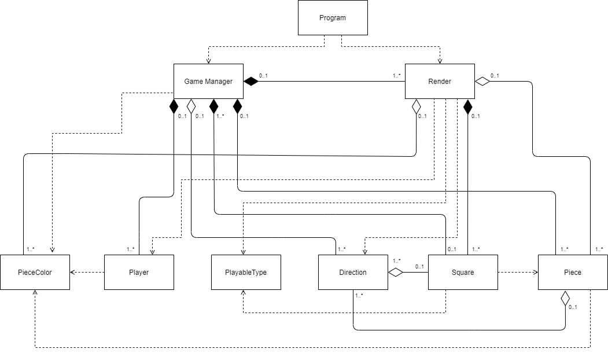

# Felli - Grupo 06

## Autoria

[Inês Barradas](https://github.com/kiray96) - a21803669

[André Pedro](https://github.com/andre-pedro) - a21701115  

## Repartição de Tarefas

Inês Barradas:

* Criação do *Spawn* das entidades
* Criação e desenvolvimento do movimento dos agentes
* Criação da verificação da condição de vitória
* Criação e desenvolvimento da class `Player`
* Documentação (README and UML)
* Doxygen

André Pedro:

* Criação e desenvolvimento do *Board*
* Desenvolvimento do *Spawn* das entidades
* Definição dos movimentos possíveis
* Desenvolvimento e conclusão da verificação da condição de vitória
* Criação do movimento e das suas direções
* Criação do Gameloop

## Repositório

O repositório do projeto está disponível
[aqui](https://github.com/kiray96/Projecto2LP1_Felli)

## Arquitetura da Solução

### Descrição da Solução

No `Program` começamos por chamar o `MainMenu` contido no `Render`. Em seguida
criamos o `GameManager` e no seu construtor é iniciado um array bidimensional
5x5 que é a nossa grid. Cada posição da mesma contem um `Square` onde estás
inserido um *playable type* que pode ser verdadeiro ou não (isto para efeitos de
renderização do *board*).
De seguida é chamado o método `SpawnEntities()` onde adicionamos as peças aos
seus respetivos `Square` e alteramos alguns para serem *nonplayable*. Para cada
`Square` (posição), atribuímos os movimentos possíveis a partir de cada posição
visto que cada *square* contem um `Direction[]` com o método `SetPossibleMovements()`.
Para criar os *players* consoante o input do *player* 1 criamos o método
`CreatePlayers()` fazendo com que o *player* 1 escolha com que peças quer jogar.
Após isto é chamado o `GameLoop()`.

No `GameLoop()` começa por ser atualizado o estado de cada peça verificando se
está bloqueada para evitar que o jogador escolha peças inválidas para jogar. É
recolhido em seguida o *input* da escolha de peça escolhida pelo utilizador.
Para verificação de escolha de uma peça inválida utilizamos então o método  
`SelectPlayingPiece()` que verifica se o utilizador escolheu um Id que não
existe, um *input* inválido ou se a peça se encontra bloqueada.
De seguida é criado um `tuple` que contem 4 itens (`bool`: validez de movimento,
`int`: linha, `int`: coluna, `bool`: apagar o inimigo). Então é pedido o *input*
do movimento ao jogador e o mesmo é verificado através do método `CheckMovement()`
que recebe o *input* e retorna valores para dentro do `tuple`. Assim o item 1 do
`tuple` (validez do movimento) for `true` a peça é movida para as posições
recebidas através do item 2 e 3 do `tuple` e o inimigo pode ser "apagado" ou não
(caso tenhamos andado uma ou duas casas).
De seguida é atualizado o estado de bloqueio de cada peça através do método
`UpdateBlockedPieces()`. Por fim com o método `CheckWin()` verificamos que houve
uma vitória. Caso tenha havido é mostrado o vencedor e o `GameLoop()` termina,
se não existir nenhum vencedor o turno é trocado e o ciclo é repetido.

### Diagrama UML

## Referências

* [The C# Player's Guide](http://starboundsoftware.com/books/c-sharp/CSharpPlayersGuide-Sample.pdf)
* [C# Programming Yellow Book](https://static1.squarespace.com/static/5019271be4b0807297e8f404/t/5824ad58f7e0ab31fc216843/1478798685347/CSharp+Book+2016+Rob+Miles+8.2.pdf)
* [StackOverflow](https://stackoverflow.com/)
* [.NET API](https://docs.microsoft.com/en-us/dotnet/api/?view=netcore-2.2)
